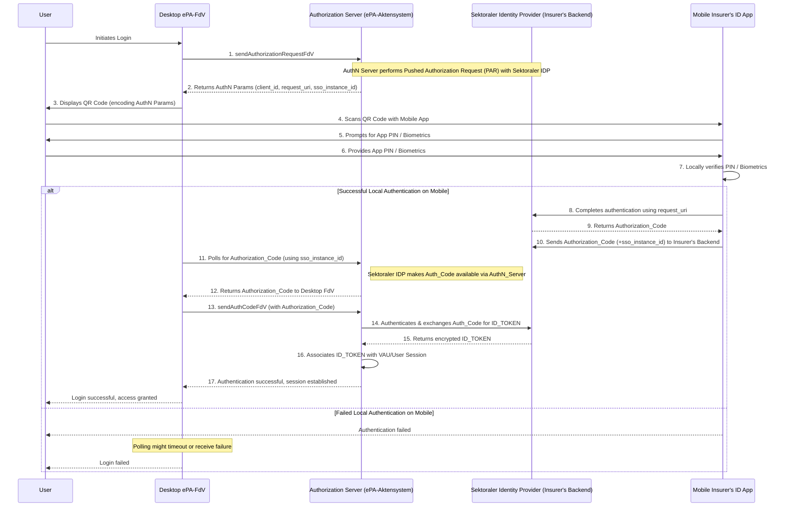

**Step-by-Step Description:**

1.  **User Initiates Login (User to Desktop\_FdV):** The user starts the login process on their desktop ePA-Frontend des Versicherten (FdV) application.
2.  **`sendAuthorizationRequestFdV` (Desktop\_FdV to AuthN\_Server):** The Desktop FdV sends an authorization request to the Authorization Server (AuthN Server) located within the ePA-Aktensystem. This is done using the `sendAuthorizationRequestFdV` operation.
    *   *Internal Note:* The AuthN Server then performs a Pushed Authorization Request (PAR) with the Sektoraler Identity Provider (IDP, which is the insurer's backend system), authenticating itself and pre-registering the authorization details.
3.  **Return Authentication Parameters (AuthN\_Server to Desktop\_FdV):** The AuthN Server responds to the Desktop FdV with necessary authentication parameters. These include:
    *   `client_id`: Identifies the ePA-Aktensystem.
    *   `request_uri`: A reference to the pre-registered authorization request at the Sektoraler IDP.
    *   `sso_instance_id` (as per A_27569): A unique identifier for this specific login attempt, used for correlating the desktop session with the mobile authentication.
4.  **Display QR Code (Desktop\_FdV to User):** The Desktop FdV encodes the received authentication parameters (especially `request_uri` and `sso_instance_id`) into a QR code and displays it to the user.
5.  **Scan QR Code (User to Mobile\_Insurer\_ID\_App):** The user uses their Mobile Insurer's ID App (which acts as the Authenticator-Modul) on their smartphone to scan the QR code displayed on the desktop. This transfers the authentication context to the mobile app.
6.  **Prompt for App Credentials (Mobile\_Insurer\_ID\_App to User):** The Mobile Insurer's ID App prompts the user to authenticate locally using the app's configured security method (e.g., app-specific PIN or device biometrics like fingerprint/face ID).
7.  **Provide App Credentials (User to Mobile\_Insurer\_ID\_App):** The user provides their PIN or uses biometrics on their mobile device.
8.  **Local Verification (Mobile\_Insurer\_ID\_App):** The Mobile Insurer's ID App verifies the entered PIN or biometric data locally on the device.

    **(If Local Authentication on Mobile is Successful):**

9.  **Complete Authentication with IDP (Mobile\_Insurer\_ID\_App to Sektoraler\_IDP):** The Mobile Insurer's ID App, having successfully verified the user locally, uses the `request_uri` (obtained from the QR code) to securely communicate with the Sektoraler IDP (insurer's backend) and complete the authentication process for the `GesundheitsID`.
10. **Return `Authorization_Code` (Sektoraler\_IDP to Mobile\_Insurer\_ID\_App):** The Sektoraler IDP, upon successful authentication, issues an `Authorization_Code` and sends it back to the Mobile Insurer's ID App.
11. **Send `Authorization_Code` to Backend (Mobile\_Insurer\_ID\_App to Sektoraler\_IDP):** The Mobile Insurer's ID App sends the received `Authorization_Code`, along with the `sso_instance_id` (for correlation), to its backend (Sektoraler IDP). This makes the code available for the desktop session.
12. **Poll for `Authorization_Code` (Desktop\_FdV to AuthN\_Server):** Concurrently, the Desktop FdV starts polling an endpoint on the AuthN Server (or directly the Sektoraler IDP's backend, depending on the architecture), using the `sso_instance_id` to check if the `Authorization_Code` for its session is ready.
13. **Return `Authorization_Code` to Desktop (AuthN\_Server to Desktop\_FdV):** Once the Sektoraler IDP has processed the `Authorization_Code` from the mobile app and made it available (potentially via the AuthN Server), the Desktop FdV's polling request succeeds, and it receives the `Authorization_Code`.
14. **`sendAuthCodeFdV` (Desktop\_FdV to AuthN\_Server):** The Desktop FdV now sends the `Authorization_Code` it received to the AuthN Server using the `sendAuthCodeFdV` operation.
15. **Exchange `Authorization_Code` for `ID_TOKEN` (AuthN\_Server with Sektoraler\_IDP):** The AuthN Server authenticates itself again to the Sektoraler IDP and exchanges the `Authorization_Code` for an encrypted `ID_TOKEN`. This token contains the verified user's personal data.
16. **Return `ID_TOKEN` (Sektoraler\_IDP to AuthN\_Server):** The Sektoraler IDP returns the encrypted `ID_TOKEN` to the AuthN Server.
17. **Associate `ID_TOKEN` with Session (AuthN\_Server):** The AuthN Server associates the user data from the `ID_TOKEN` with the secure VAU (Trusted Execution Environment) / User Session for the Desktop FdV. The user's identity is now confirmed for the ePA-Aktensystem.
18. **Authentication Successful (AuthN\_Server to Desktop\_FdV):** The AuthN Server signals to the Desktop FdV that authentication was successful and the session is established.
19. **Login Successful (Desktop\_FdV to User):** The Desktop FdV informs the user that the login was successful, and they now have access to their ePA.

    **(If Local Authentication on Mobile Fails):**

*   **Authentication Failed (Mobile\_Insurer\_ID\_App to User):** The mobile app informs the user that their local authentication (PIN/biometric) failed.
*   **Polling Timeout/Failure (Desktop\_FdV):** The Desktop FdV's polling for the `Authorization_Code` will eventually time out or might receive a failure notification.
*   **Login Failed (Desktop\_FdV to User):** The Desktop FdV informs the user that the login process has failed.
