# Strategic Roadmap: Fasten Health On-Prem ePA Integration

## Foreword: ePA Integration Approaches

This strategic roadmap outlines the path for integrating Fasten Health On-Prem with the German electronic patient record (ePA) system by pursuing the **direct registration and approval of Fasten Health's own ePA-Frontend des Versicherten (ePA-FdV) with gematik.** This approach involves Fasten Health undergoing the complete approval lifecycle, including security assessments, product evaluations, and operational readiness checks as mandated by gematik for its FdV. The subsequent phases detailed in this document are predicated on this direct approval strategy.

Alternatively, another potential approach for ePA integration could involve **leveraging an existing, gematik-approved ePA-FdV module from an intermediary third-party provider.** In such a scenario, Fasten Health would integrate this pre-approved module into its application. This could potentially streamline parts of the approval process, as the core FdV component would already have gematik's sanction. However, this approach would introduce dependencies on the third-party provider, including their update cycles, feature sets, and any associated costs or licensing terms. The specifics of integration, data flow, and residual responsibilities for Fasten Health would need careful evaluation if this path were to be considered.

**The current roadmap exclusively details the direct FdV registration approach.**

## Subject: Strategic Roadmap for Fasten Health On-Prem ePA Integration

## Primary Objective:

Develop a comprehensive, step-by-step strategic roadmap for integrating Fasten Health On-Prem with the German electronic patient record (ePA) system. The roadmap should culminate in a Fasten Health user (a German insured individual) being able to securely connect their Fasten Health installation to their personal ePA records and download these records for use within the application. This roadmap targets compliance with **Produkttypversion (PTV) 3.1.2-0** of the ePA-Frontend des Versicherten (ePA-FdV).

## Key Deliverables & Goals:

1.  Understand the ePA Ecosystem & Approval Process.
2.  Information Gathering & Contextual Analysis.
3.  Define Integration Scope (Exclusions: NO TI-Messenger, NO E-Rezept).
4.  Develop a Phased Roadmap.
5.  Present the final roadmap in this Markdown file, using structured data formats (Tables, Mermaid diagrams, Checklists).

## Information Sources & Interpretation:

This roadmap is based on the analysis of the following gematik documents, with a focus on the versions specified for PTV 3.1.2-0 in its Produkttypsteckbrief:

*   `gemZul_Prod_ePA_FdV_V1.5.0.pdf` (ePA-FdV Product Approval Procedure) - PTV 3.1.2-0 references v1.3.0 (Needs verification against PTV 3.1.2-0 Steckbrief).
*   `gemSpec_ePA_FdV_V2.5.0.pdf` (ePA-FdV Specifications) - As specified in `gemProdT_ePA_FdV_PTV_3.1.2-0_V1.0.0.pdf`.
*   `gemKPT_Test_V2.10.0.pdf` (TI Test Concept) - As specified in `gemProdT_ePA_FdV_PTV_3.1.2-0_V1.0.0.pdf`.
*   `gemProdT_ePA_FdV_PTV_3.1.2-0_V1.0.0.pdf` (ePA-FdV Product Type Steckbrief for PTV 3.1.2-0).
*   `gemRL_PruefSichEig_DS_V2.2.0.pdf` (Guideline for Security Suitability Testing).
*   `gemZul_Best_SiGu_V1.13.0.pdf` (Confirmation of Security Assessment Procedure).
*   `gemKPT_Inbetriebnahme_ePA-FdV_V2.0.0.pdf` (Controlled Commissioning Concept for ePA-FdV).
*   `gemVZ_Afo_Herst_FdV_V_1.2.0_V1.0.0.pdf` (Operational Requirements for FdV Manufacturers).
*   `gemZul_uebergrVerf_V2.11.0.pdf` (Overarching Approval Procedure) - PTV 3.1.2-0 references v2.10.0 (Needs verification against PTV 3.1.2-0 Steckbrief).

The roadmap prioritizes compliance with the specific document versions listed in the `gemProdT_ePA_FdV_PTV_3.1.2-0_V1.0.0.pdf` Steckbrief for achieving approval for PTV 3.1.2-0. It is critical to verify the versions of all referenced gematik documents against the contents of the PTV 3.1.2-0 Steckbrief, as the versions listed above are based on the previous PTV 3.1.0-1 Steckbrief unless a newer version was explicitly provided.

Additional relevant documents reviewed include:
*   `docs/epa/ePA User Authentication Desktop FdV with Mobile Insurer ID App (QR Code Handoff for PIN-Biometric Verification).md`: Provides a detailed example of a potential authentication flow.
*   Documents in `docs/epa/HealthID/`: May provide additional context on GesundheitsID, which is central to authentication. Their direct normative impact on FdV approval should be confirmed.

## Overall ePA-FdV Approval Lifecycle (Simplified)

```mermaid
graph TD
    A[Start: Project Planning] --> B{Meet SiGu Requirements?};
    B -- Yes --> C[Prepare & Undergo Sicherheitsgutachten Audit];
    C --> D[Submit SiGu to gematik];
    D --> E{SiGu Confirmed?};
    E -- Yes --> F[Prepare & Undergo Produktgutachten Audit];
    E -- No --> C;
    F --> G[Develop & Test ePA-FdV Features EvT];
    G --> H[Prepare Manufacturer Operational Readiness];
    H --> I[Undergo Operational Process Audit];
    I --> J[Compile Zulassung Application];
    J --> K[Submit Application to gematik];
    K --> L{Application Complete & Accepted?};
    L -- Yes --> M[gematik Zulassungstest - ZulT];
    L -- No --> J;
    M --> N{ZulT Successful?};
    N -- Yes --> O[Receive Zulassung with KIB Nebenbestimmung];
    N -- No --> G;
    O --> P[Plan & Prepare KIB Umsetzungsbeschreibung];
    P --> Q[Submit Umsetzungsbeschreibung to gematik];
    Q --> R{Umsetzungsbeschreibung Approved?};
    R -- Yes --> S[Execute KIB in Production];
    R -- No --> P;
    S --> T[Prepare KIB Abschlussbericht];
    T --> U[Submit Abschlussbericht to gematik];
    U --> V{KIB Successful?};
    V -- Yes --> W[Receive Final Zulassung - KIB Restrictions Lifted];
    V -- No --> P;
    W --> X[Full Rollout & Ongoing Operations];

    classDef green fill:#9f6,stroke:#333,stroke-width:2px;
    classDef red fill:#f9f,stroke:#333,stroke-width:2px;
    classDef yellow fill:#ff9,stroke:#333,stroke-width:2px;
    class E,L,N,R,V yellow;
    class W green;
```

**Note:** The following phased roadmap outlines the general steps based on the ePA-FdV approval process. However, the specific activities, timelines, required resources, potential challenges, deliverables, and the detailed "Key Requirements Checklist" **must be thoroughly re-evaluated and updated based on the detailed contents of the newly referenced documents:** `gemProdT_ePA_FdV_PTV_3.1.2-0_V1.0.0.pdf`, `gemSpec_ePA_FdV_V2.5.0.pdf`, and `gemKPT_Test_V2.10.0.pdf`. These documents contain the normative requirements and testing procedures for PTV 3.1.2-0.

## Phased Strategic Roadmap

### Phase 0: Foundation & Strategic Planning

*   **Objective:** Establish a clear understanding of all requirements for ePA-FdV PTV 3.1.0-1, define project scope precisely, assemble the team, and create a detailed internal project plan.
*   **Key Activities:**
    *   Detailed review and interpretation of all normative requirements listed in `gemProdT_ePA_FdV_PTV_3.1.2-0_V1.0.0.pdf` from the specified versions of source documents (`gemSpec_ePA_FdV V2.3.1`, `gemKPT_Test V2.9.0`, etc.).
    *   Perform a gap analysis between the current Fasten Health On-Prem architecture/features and the ePA-FdV PTV 3.1.0-1 requirements (functional, technical, security, operational).
    *   Define the precise scope of the ePA integration feature within Fasten Health On-Prem, adhering to the exclusion of TI-Messenger and E-Rezept.
    *   Assemble the core project team, including development, legal/compliance, testing, and security expertise.
    *   Develop a detailed internal project plan with timelines, milestones, and resource allocation.
    *   Initiate contact with gematik for initial consultation regarding the approval process and requirements.
*   **Estimated Timeline:** 1-2 months
*   **Required Resources:** Project Manager, Solution Architect, Lead Developer, Legal/Compliance Expert, Security Expert.
*   **Potential Challenges:** Complexity and detail level of gematik specifications, interpreting requirements correctly, initial contact and understanding with gematik.
*   **Deliverables:**
    *   Detailed Project Plan
    *   Gap Analysis Report
    *   Resource Allocation Plan
    *   Initial understanding of gematik processes and contacts.

### Phase 1: Security Assessment (`Sicherheitsgutachten`) Preparation & Confirmation

*   **Objective:** Achieve gematik confirmation for the required Security Assessment (`Sicherheitsgutachten`), which evaluates the security of the manufacturer's processes.
*   **Key Activities:**
    *   Identify all requirements from `gemProdT_ePA_FdV_PTV_3.1.2-0_V1.0.0.pdf` (Section 3.2.3) that are subject to the `Sicherheitsgutachten`. These relate to secure development lifecycle, vulnerability management, change management, etc., as defined in documents like `gemSpec_DS_Hersteller` (referenced in `gemVZ_Afo_Herst_FdV`).
    *   Ensure internal processes and documentation meet these requirements.
    *   Engage a qualified `Sicherheitsgutachter` (meeting the base qualification and gematik's additional qualification as per `gemRL_PruefSichEig_DS_V2.2.0`).
    *   Undergo the `Sicherheitsgutachten` audit, providing necessary documentation and access.
    *   Obtain the formal `Sicherheitsgutachten` report from the assessor.
    *   Submit the `Sicherheitsgutachten` report to gematik and apply for its confirmation as per the procedure in `gemZul_Best_SiGu_V1.13.0.pdf`.
    *   Address any questions or requests from gematik during the confirmation process.
*   **Estimated Timeline:** 3-4 months (includes audit and gematik processing time)
*   **Required Resources:** Security Team, Legal/Compliance, Project Management, External `Sicherheitsgutachter`.
*   **Potential Challenges:** Finding a qualified and available `Sicherheitsgutachter`, complexity of process documentation, gematik processing time.
*   **Deliverables:**
    *   Documented and implemented secure manufacturer processes.
    *   Completed `Sicherheitsgutachten` report.
    *   Gematik Confirmation of Security Assessment (`Bestätigungsbescheid`).

### Phase 2: ePA-FdV Product Development & Internal Testing (EvT)

*   **Objective:** Develop and test Fasten Health On-Prem to meet all functional and technical requirements of ePA-FdV PTV 3.1.0-1 and successfully complete Eigenverantwortliche Tests (EvT).
*   **Key Activities:**
    *   Implement all ePA-FdV functionalities based on the detailed requirements from `gemSpec_ePA_FdV V2.3.1` and other relevant specifications for PTV 3.1.0-1 (e.g., IHE profiles, security measures, data handling, user interface elements, configuration parameters).
    *   Develop the Test Driver module as required for automated testing by gematik (`gemSpec_ePA_FdV` Section 6.3, `gemKPT_Test` Section 9.1).
    *   Set up access to the gematik Referenzumgebung (RU) for self-testing.
    *   Develop comprehensive test cases covering all functional and non-functional requirements for PTV 3.1.0-1.
    *   Conduct rigorous internal testing (Eigenverantwortliche Tests - EvT) in the RU, including Produkttests (EvT) and Produktübergreifende Tests (EvT) as per `gemKPT_Test V2.9.0`. Aim for 100% test coverage of mandatory requirements.
    *   Document all EvT activities and results meticulously, creating the full suite of EvT documentation (Testkonzept, Testspezifikation, Testprotokoll, Testbericht, Release Notes, Produktdokumentation, Afo_Testmatrix) according to gematik templates and guidelines (`gemKPT_Test` Section 4.7).
*   **Estimated Timeline:** 6-9 months (Development and comprehensive internal testing)
*   **Required Resources:** Development Team (Go backend, Angular frontend), QA Team, Technical Writers, Access to RU.
*   **Potential Challenges:** Implementing complex ePA specifications (e.g., IHE, VAU, authentication flows), achieving 100% test coverage, integrating with test environments, documentation effort.
*   **Deliverables:**
    *   Fasten Health On-Prem build with ePA-FdV PTV 3.1.0-1 compliant features.
    *   Functional Test Driver module.
    *   Complete suite of EvT documentation.

### Phase 3: Manufacturer Operational Readiness & Approval (`Herstellerzulassung`)

*   **Objective:** Fulfill all operational requirements for an FdV manufacturer and prepare for the manufacturer approval process, which runs in parallel with product approval.
*   **Key Activities:**
    *   Implement operational processes required for an FdV manufacturer as per `gemVZ_Afo_Herst_FdV_V_1.2.0` (e.g., participation in TI-ITSM, incident and problem management, communication channels, support structures).
    *   Document these operational processes.
    *   Prepare for and undergo the `Prozessprüfung` (process audit) for operational suitability by gematik or an accredited auditor, covering requirements listed in `gemVZ_Afo_Herst_FdV` Section 3.1.1.
    *   Compile `Herstellererklärung` (manufacturer declarations) for operational suitability, confirming adherence to requirements in `gemVZ_Afo_Herst_FdV` Section 3.1.2.
*   **Estimated Timeline:** 2-3 months (Can overlap with Phase 2)
*   **Required Resources:** Operations Team, IT Support, Project Management, External Auditor (if applicable).
*   **Potential Challenges:** Aligning internal processes with TI-ITSM, documentation of processes, scheduling and undergoing the process audit.
*   **Deliverables:**
    *   Documented and implemented operational processes.
    *   Successful Process Audit report.
    *   Completed Manufacturer Declarations for operational suitability.

### Phase 4: gematik Product Approval (`Produktzulassung ePA-FdV`)

*   **Objective:** Obtain formal product approval for Fasten Health On-Prem as an ePA-FdV PTV 3.1.0-1 from gematik, with the ancillary provision for KIB.
*   **Key Activities:**
    *   Submit the formal application for "Zulassung Produkt ePA-FdV" via the gematik portal, referencing the confirmed `Sicherheitsgutachten` (from Phase 1).
    *   Submit all required proofs and documentation: gematik Confirmation of Security Assessment, complete EvT documentation suite, product build, Test Driver.
    *   Engage a qualified `Produktgutachter` (meeting criteria in `gemRL_PruefSichEig_DS_V2.2.0`, including BSI recognition and app testing experience).
    *   Undergo the `Produktgutachten` audit, which includes deep technical testing, source code analysis, and penetration testing. This covers requirements listed in `gemProdT_ePA_FdV_PTV_3.1.2-0_V1.0.0.pdf` Section 3.2.1.
    *   Submit the formal `Produktgutachten` report to gematik.
    *   Support gematik during their formal Zulassungstests (ZulT) in the Testumgebung (TU), including Eingangsprüfung (ZulT), Produkttest (ZulT), and Produktübergreifender Test (ZulT) as per `gemKPT_Test V2.9.0`. Provide Whitelabel-Apps and necessary devices/card readers as required by `gemKPT_Test` Section 9.2.
    *   Address any findings or requests for corrections from gematik during the ZulT.
*   **Estimated Timeline:** 4-6 months (Gematik processing and testing time)
*   **Required Resources:** Project Management, QA Team, Development Team (for bug fixing), External `Produktgutachter`, Provision of Test Objects (Whitelabel-Apps, devices, card readers).
*   **Potential Challenges:** Gematik testing findings requiring significant rework, coordination with external assessors and gematik test teams, gematik processing time.
*   **Deliverables:**
    *   Submitted application and all required documentation/proofs.
    *   Completed `Produktgutachten` report.
    *   Successful completion of gematik Zulassungstests.
    *   Gematik Product Approval (`Zulassungsbescheid`) for ePA-FdV PTV 3.1.0-1, explicitly stating the requirement to conduct KIB.

### Phase 5: Controlled Commissioning (KIB)

*   **Objective:** Successfully complete the Controlled Commissioning (KIB) in the productive environment with a limited user group and obtain final clearance from gematik to lift restrictive conditions.
*   **Key Activities:**
    *   Prepare the `Umsetzungsbeschreibung` (implementation description) for KIB as per `gemKPT_Inbetriebnahme_ePA-FdV_V2.0.0`. This includes defining the scope, planned duration, procedure, specific use cases to be tested, and identifying participating users and Healthcare Provider Institutions (LEIs) according to the specified Mengengerüste (minimum quantities).
    *   Submit the `Umsetzungsbeschreibung` to gematik and await their formal approval.
    *   Once the `Umsetzungsbeschreibung` is approved and the `Zulassungsbescheid` with KIB Nebenbestimmung is received (from Phase 4), formally notify gematik of the planned KIB start date.
    *   Execute the KIB in the live production environment with the selected participants, running the defined use cases and documenting the process.
    *   Monitor the KIB closely, manage any incidents or problems via the TI-ITSM process, and coordinate with involved parties (users, LEIs, other TI service providers).
    *   Prepare the `Abschlussbericht` (final KIB report) detailing the execution, results, any incidents encountered and their resolution, and confirming adherence to the Mengengerüste and successful use case execution.
    *   Submit the `Abschlussbericht` to gematik.
    *   Participate in the `Abschlussmeeting` (final meeting) with gematik to review the KIB results and decide on lifting the restrictive conditions.
*   **Estimated Timeline:** 2-4 months (Includes planning, execution, and reporting)
*   **Required Resources:** Project Management, QA Team, Operations Team, Participating Users, Participating LEIs, Coordination with other TI Service Providers.
*   **Potential Challenges:** Recruiting participating users and LEIs, managing issues in a production environment, coordination across multiple external parties, gematik review time for reports.
*   **Deliverables:**
    *   Approved `Umsetzungsbeschreibung`.
    *   Successful KIB execution in production.
    *   Completed `Abschlussbericht`.
    *   Gematik confirmation lifting KIB restrictions.

### Phase 6: Full Rollout & Ongoing Operations

*   **Objective:** Launch the approved ePA-FdV functionality to all Fasten Health On-Prem users and maintain ongoing compliance, security, and operational readiness.
*   **Key Activities:**
    *   Plan and execute the full rollout of the ePA-FdV feature to the entire Fasten Health On-Prem user base.
    *   Provide ongoing user support and technical maintenance.
    *   Actively participate in the TI-ITSM processes for incident and problem management in the productive environment.
    *   Establish a process for monitoring gematik announcements regarding specification updates or new PTVs.
    *   Plan for periodic renewals of the `Sicherheitsgutachten` (every 3 years) and `Produktgutachten` (full assessment every 3 years, delta assessments annually if significant changes occur) as required by `gemRL_PruefSichEig_DS`.
    *   Manage product updates and changes according to the gematik procedure for changes to approved subjects (`gemZul_uebergrVerf` Section 3.6), which may require new tests or assessments depending on the nature of the change.
    *   Continuously monitor security landscape and address vulnerabilities in a timely manner, adhering to manufacturer obligations (`gemVZ_Afo_Herst_FdV`).
*   **Estimated Timeline:** Ongoing
*   **Required Resources:** Development Team, Operations Team, Support Team, Security Team, Legal/Compliance.
*   **Potential Challenges:** Managing user support for a new complex feature, staying updated with evolving gematik requirements, planning and executing periodic re-approvals, responding to security incidents.
*   **Deliverables:**
    *   Successfully launched ePA integration feature.
    *   Established ongoing maintenance, support, and compliance processes.
    *   Plan for future updates and re-approvals.

## Key Requirements Checklist (Examples)

This is not exhaustive but highlights some critical requirements based on the reviewed documents:

*   [ ] Implement ePA-FdV features according to `gemSpec_ePA_FdV V2.3.1`.
*   [ ] Ensure local execution of ePA-specific code (A_16973-01).
*   [ ] Implement security measures against OWASP Mobile Top 10 (A_15255-01).
*   [ ] Avoid advertising tracking and adhere to strict rules for other tracking (A_15256-02, A_18767-A_18778, A_25267).
*   [ ] Implement secure handling and storage of keys and session data (A_15252-02, A_15253-01, A_15254-01).
*   [ ] Implement secure authentication using GesundheitsID and device registration (A_20746, A_15305-03, A_24924, A_26149).
*   [ ] Implement secure communication via TLS and VAU (A_15297-01, A_15304-02).
*   [ ] Implement IHE Document Consumer/Source/Admin/Update Initiator roles and relevant transactions (ITI-18, ITI-43, ITI-41, ITI-62, ITI-92).
*   [ ] Support document sizes up to 25MB (A_15283-01).
*   [ ] Implement document upload (A_24707), search (A_24706), download (A_24708), delete (A_24709), and metadata update (A_24198).
*   [ ] Implement management of consents/objections (A_23875, A_23880-01).
*   [ ] Implement management of access rights (Befugnisse) for LEIs, DiGAs, representatives (A_23968, A_23960, A_23971).
*   [ ] Implement signing of entitlements (A_24399-01).
*   [ ] Implement hiding/unhiding documents (A_24357, A_24363-01).
*   [ ] Implement log management and export (A_24698-01, A_21129-03).
*   [ ] Implement device management (A_24792, A_24802, A_24803).
*   [ ] Implement email address management (A_25442-01).
*   [ ] Implement UX measurement data collection and transmission (A_24669, A_24670).
*   [ ] Implement Test Driver module (A_18044-02).
*   [ ] Conduct comprehensive EvT and document results according to `gemKPT_Test V2.9.0`.
*   [ ] Establish and document operational processes (ITSM, etc.) according to `gemVZ_Afo_Herst_FdV_V_1.2.0`.
*   [ ] Obtain gematik Confirmation of `Sicherheitsgutachten` (`gemZul_Best_SiGu_V1.13.0.pdf`).
*   [ ] Obtain `Produktgutachten` from qualified assessor (`gemRL_PruefSichEig_DS_V2.2.0.pdf`).
*   [ ] Successfully complete gematik Zulassungstests (`gemKPT_Test V2.9.0`).
*   [ ] Successfully complete Controlled Commissioning (KIB) (`gemKPT_Inbetriebnahme_ePA-FdV_V2.0.0.pdf`).

## Potential Challenges & Mitigation Strategies

| Challenge                                        | Mitigation Strategy                                                                                                |
| :----------------------------------------------- | :----------------------------------------------------------------------------------------------------------------- |
| Complexity of gematik specifications             | Dedicated team for requirements analysis, early engagement with gematik consultation, phased implementation.         |
| Finding qualified external assessors             | Research and engage with accredited `Sicherheitsgutachter` and `Produktgutachter` early in the process.            |
| Gematik processing and testing timelines         | Plan with buffer time, maintain clear communication with gematik, address findings promptly.                         |
| Achieving 100% test coverage (EvT)               | Invest in robust internal testing infrastructure and automation, meticulous test case design and execution.          |
| Coordinating KIB with external parties (users, LEIs) | Develop a clear KIB plan, recruit participants early, provide clear instructions and support, use TI-ITSM effectively. |
| Evolving gematik requirements                    | Monitor gematik publications and announcements, build flexibility into the architecture where possible.              |

This roadmap provides a strategic overview and key steps required for Fasten Health On-Prem to integrate with the German ePA system and achieve gematik approval for PTV 3.1.0-1.
